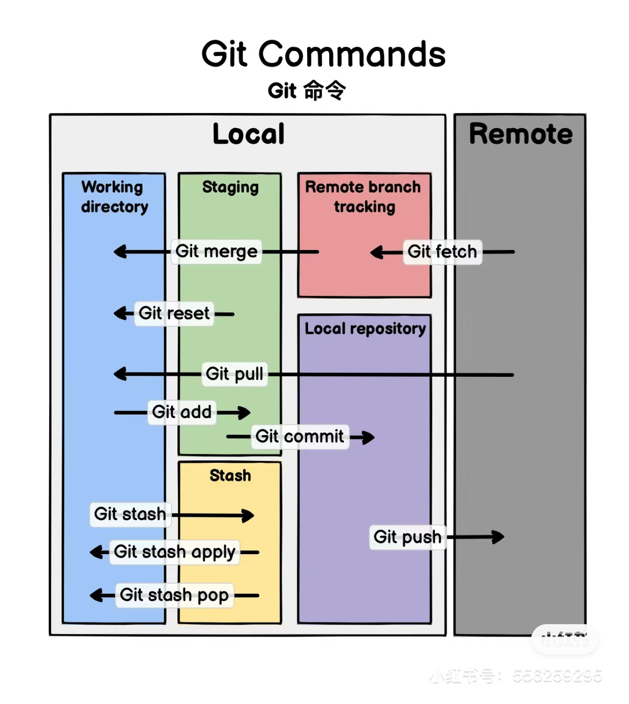

# ROS2_Project und Git
## Git
Overview:



- [Basic](#basic)
  - [settings](#settings)
      - [basic settings](#basic-settings)
      - [help messages](#help-messages)
- [creating snapshots](#creating-snapshots)
  - [status](#status)
  - [diff, difftool](#diff-difftool)
  - [show, ls-tree, restore, clean](#show-ls-tree-restore-clean)
- [Browsing history](#browsing-history)
  - [`--state`, `--patch`](#--state---patch)
  - [filter commits](#filter-commits)
  - [format git log](#format-git-log)
  - [Creating Aliases](#creating-aliases)
  - [viewing a commit](#viewing-a-commit)
  - [viewing the changes between commits](#viewing-the-changes-between-commits)
  - [checking out a commit](#checking-out-a-commit)
  - [finding bugs using bisect](#finding-bugs-using-bisect)
  - [finding contributors using shortlog](#finding-contributors-using-shortlog)
  - [viewing history of a file](#viewing-history-of-a-file)
  - [restoring a deleting file](#restoring-a-deleting-file)
  - [git blame and finding the author line by line](#git-blame-and-finding-the-author-line-by-line)
  - [tagging](#tagging)
- [Branching](#branching)
  - [working with branches](#working-with-branches)
  - [comparing branches](#comparing-branches)
  - [stashing](#stashing)
  - [merging](#merging)
    - [fast-forward merges(if branches have not diverged)](#fast-forward-mergesif-branches-have-not-diverged)
    - [three-way merges(if branches have diverged)](#three-way-mergesif-branches-have-diverged)
  - [viewing merged and unmerged branches](#viewing-merged-and-unmerged-branches)
  - [merge conflicts](#merge-conflicts)
  - [aborting a merge](#aborting-a-merge)
  - [undoing a faulty merge](#undoing-a-faulty-merge)
    - [`reset`](#reset)
    - [`revert`](#revert)
  - [squash merging](#squash-merging)
  - [rebasing](#rebasing)
  - [cherry picking](#cherry-picking)
  - [picking a file from another branch](#picking-a-file-from-another-branch)
- [Collaborating](#collaborating)
  - [remote tacking branch](#remote-tacking-branch)
  - [fetching](#fetching)
  - [pulling(fetch + merge)](#pullingfetch--merge)
  - [pushing](#pushing)
  - [sharing tags](#sharing-tags)
  - [sharing branches](#sharing-branches)
  - [collaboration workflow](#collaboration-workflow)
  - [keeping a forked repository up to date](#keeping-a-forked-repository-up-to-date)
- [rewriting history](#rewriting-history)
  - [undoing commits](#undoing-commits)
  - [reverting commits](#reverting-commits)
  - [recovering lost commits](#recovering-lost-commits)
  - [amending the last commits](#amending-the-last-commits)
  - [amending an earlier commit](#amending-an-earlier-commit)
  - [dropping commits](#dropping-commits)
  - [rewording commit messages](#rewording-commit-messages)
  - [reordering commits](#reordering-commits)
  - [squashing commits](#squashing-commits)
  - [splitting a commit](#splitting-a-commit)
- [extra tips](#extra-tips)
  - [Push commit to different remote branch](#push-commit-to-different-remote-branch)
  - [Dry run push](#dry-run-push)
    - [Update forked repository to original repository latest](#update-forked-repository-to-original-repository-latest)
- [Git in VMWare](#vmware虚拟机的ubuntu里-git-的使用)


## Basic

- why vcs
  - track history
  - work together
- types
  - centralized (subversion, team foundation server )
  - distributed (git, mercurial)
- why git
  - free
  - open source
  - super fast
  - scalable
  - cheap branching and merging

### settings

- levers
  - system
  - global
  - local
##### basic settings

```bash
git config --global user.name "xyh"
git config --global user.email ""
git config --global core.editor ""
git config --global -e # open global settings
git config --global core.autocrlf "" # windows - true, mac - input
```

##### help messages

```bash
git config --help # details
git config -h # brief
```

## Creating Snapshots

- staging area(last snapshot version)

once first commit be created staging area exists.

```bash
git add file1 # add file1 to staging area
```

```bash
git commit -m 'first commit' # every commit git store fill content not diff
```

- add and commit to staging at same time 
- "-am" is same "-a -m" a(all) m(modify) 

```bash
git commit -am 'Refactor code.'
```

- remove from staging area

```bash
git rm --cached -r bin/
```

- Renaming or Moving Files

```bash
git mv main.js files1.js
```

- Ignoring Files
-- creating the .gitignore files 

```bash
echo logs/ > .gitignore
```
- opening the File

```bash
code .gitignore
```

- [.gitignore template](https://github.com/github/gitignore)

### status

- "-sb: -s(short) -b(branch)

```bash
git status -sb
```

### diff, difftool
- Viewing Staged and Unstaged Changes

```bash
git diff # the diff of working directory and staging area
git diff --staged   # the diff of staging area and last commit
```

- Visual Diff Tools

-- Setting
```bash
git config --global diff.tool vscode
```
```bash
git config --global difftool.vscode.cmd "code --wait --diff $LOCAL $REMOTE"
```
```bash
git config --global -e
```

-- Open the diffTools
```bash
git difftool
```
We can check all modified file.
```bash
git difftool --staged
```

### show, ls-tree, restore, clean

- `show` will show git objects
  - commits
  - blobs(files)
  - trees(directories)
  - tags

```bash
git show HEAD # HEAD is last commit
git show HEAD~1 # HEAD~n is nth commit before last commit
git show HEAD~1:.gitignore # show the whole file
```

```bash
git ls-tree HEAD~1 # show all
```

- replace `reset` with `restore`
- `restore` move the version to the last version

```bash
git restore --staged file2.js *.js
```
- Discarding Local Changes
```bash
git clean -fd # remove un-tracking files in working directory
```

- Restoring a File to an eariler/previous version
```bash
git restore --source=HEAD~1 file1.js
```


## Browsing history

- Viewing History
```bash
git log 
git log --oneline --reverse 
```

### `--state`, `--patch`

```bash
git log --oneline --stat # the diff line numbers
git log --oneline --patch # the diff detail
```

### filter commits

```bash
git log --oneline -3 # last 3 commits
git log --oneline --author="Zhou Tao"
git log --oneline --before="2020-08-17"
git log --oneline --after="2020-08-17"
git log --oneline --after="yesterday"
git log --oneline --after="one week ago"
git log --oneline --grep="commit   lomessage term"
git log --oneline -S "git" # search all commit include the search contents and show commit
git log --oneline -S "git" --patch # show the diff it self
git log --oneline fb0d..dad47 # show between range of two commits
git log --oneline netlify.toml # all the commits that modified specific file
git log --oneline -- netlify.toml # file name is ambiguous
git log --oneline --patch -- netlify.toml # show commit content
```

### format git log

```bash
git log --pretty=format:"%an committed %h on %cd" # %an -> author name, %h -> hash value, %cd -> committed date
git log --pretty=format:"%Cgreen%an%Creset committed %h on %cd" # %Cgreen %Creset  change color
```

### Creating Aliases
- using git lg ist same as "log --pretty=format:"%an committed %h on %cd"

```bash
git config --global alias.lg "log --pretty=format:"%an committed %h on %cd"
```
- using git unsatage is same as "restore --staged ."
```bash
git config --global alias.unstage "restore --staged ."
```
### viewing a commit

```bash
git show HEAD~2
git show HEAD~2:packages/react-reconciler/src/ReactFiberCommitWork.new.js # see the final version of the commit
git show HEAD~2 --name-only
git show HEAD~2 --name-status
```

### viewing the changes between commits

```bash
git diff HEAD~2 HEAD # find the all differences between two commits
git diff HEAD~2 HEAD fixtures/concurrent/time-slicing/src/index.js # find the differences in specific file
git diff HEAD~2 HEAD --name-only
git diff HEAD~2 HEAD --name-status
```
### checking out a commit

```bash
 
git log --oneline -all
git checkout master
```

### finding bugs using bisect

```bash
git bisect bad
git bisect good c0a77029c
git bisect good
git bisect bad
git bisect reset
```

### finding contributors using shortlog

```bash
git shortlog -n -s -e  # author, commits number, email
git shortlog -nse --after="" --before=""
```
### viewing history of a file

```bash
git log --oneline --stat --patch .gitignore
```

### restoring a deleting file

```bash
git rm toc.txt
git commit -m "Removed toc.txt"
git log --oneline -- toc.txt
git checkout a642e12 toc.txt
git commit -m "Restored toc.txt"
```

### git blame and finding the author line by line

```bash
git blame .gitignore
git blame -e .gitignore
git blame -e -L 1,3 .gitignore
```
### tagging

```bash
git tag v1.0 {hash} // lightweight tag
git checkout v1.0
git tag -a v1.1 -m "My version 1.1"  // annotate tag
git tag -n # show tag message
git show v1.1
git tag -d v1.1
```

## Branching

### working with branches

```bash
git switch bugfix
git switch -C bugfix/login-form # switch and create new branch
git branch -m bugfix bugfix/signup-form # rename {oldname} {newname}
git branch -d fix/signup-form
```
### comparing branches

```bash
git log master..fix/signup-form
git log master..fix/signup-form --patch
git diff master..fix/signup-form
git diff --name-only fix/signup-form
git diff --name-status fix/signup-form
```
### stashing

```bash
git stash push -m "New stash one"
git stash push -am "New stash one" # new file stash
git stash list
git stash show stash@{1}
git stash show 1
git stash apply 0
git stash drop 0
git stash clear
```
### merging

#### fast-forward merges(if branches have not diverged)

```bash
git merge -ff bugfix/login-form
```

#### three-way merges(if branches have diverged)

```bash
git merge -no-ff bugfix/password-form
git config --global merge.ff false
git config --global pull.ff only
[merge]
    ff = false
[pull]
    ff = only
```
### viewing merged and unmerged branches

```bash
git branch --merged
git branch -d bugfix/signup-form
git branch --no-merged
```

### merge conflicts

graphical merge tools and difftool to vscode

```bash
git config --global merge.tool vscode
git config --global mergetool.vscode.cmd 'code --wait $MERGED'
git config --global mergetool.keepBackup false

git config --global diff.tool vscode
git config --global difftool.vscode.cmd 'code --wait --diff $LOCAL $REMOTE'
```

```
[merge]
        tool = vscode
[mergetool "vscode"]
        cmd = code -n --wait $MERGED
[diff]
        tool = vscode
[difftool "vscode"]
        cmd = code -n --wait --diff $LOCAL $REMOTE
```

### aborting a merge

```bash
git merge --abort
```

### undoing a faulty merge

#### `reset`

```bash
git reset --hard HEAD~1 # move git pointer to one commit before, apply snapshot to staged area and working directory
git reset --mixed HEAD~1 # default,move git pointer to one commit before, apply snapshot to staged area and working directory
git reset HEAD~1
git reset --soft HEAD~1 # default, move git pointer to one commit before

git reset --hard 882b232 # move pointer to any commit even not show in log history
```

#### `revert`

```bash
git revert -m 1 HEAD
```

### squash merging

```bash
git merge --squash fix/photo_upload # ff changes to staged area
# Updating f10f470..0d9b74a
# Fast-forward
# Squash commit -- not updating HEAD
# LICENSE   | 1 +
# README.md | 1 +
git commit -m "fixed: in photo upload"

# this branch won't show in
git branch --merge # squash merged branch won't show
git branch --unmerged # will show
git branch -D fix/photo_upload # force delete only
```
### rebasing

- no merge conflict

```bash
git switch -C 'feature/shopping-cart'
git commit
git switch master
git commit
git switch feature/shopping-cart
git rebase master
git switch master
git merge --ff feature/shopping-cart
```

- merge conflict

```bash
git rebase master
# Auto-merging toc.txt
# CONFLICT (content): Merge conflict in toc.txt
# error: could not apply 97e93a6... Update toc.txt 1
# Resolve all conflicts manually, mark them as resolved with
# "git add/rm <conflicted_files>", then run "git rebase --continue".
# You can instead skip this commit: run "git rebase --skip".
# To abort and get back to the state before "git rebase", run "git rebase --abort".
# Could not apply 97e93a6... Update toc.txt 1
git mergetool
git rebase --continue
git rebase --skip
git rebase --abor
```

### cherry picking
```bash
git cherry-pick a1f63e6
# Auto-merging toc.txt
# CONFLICT (content): Merge conflict in toc.txt
# error: could not apply a1f63e6... Update toc.txt 1
# hint: after resolving the conflicts, mark the corrected paths
# hint: with 'git add <paths>' or 'git rm <paths>'
# hint: and commit the result with 'git commit'
git add .
git commit
```
### picking a file from another branch
```bash
git switch -C feature/send-mail
git add .
git commit
git switch master
git restore --source=feature/send-mail -- mail.txt
```

## Collaborating

### remote tacking branch

```bash
git remote
git remote -v
```
### fetching

```bash
git fetch origin # download all commit
git branch -vv 
git merge origin/master
```

### pulling = (fetch + merge)

```bash
git pull # if branch diverse three way merge
git pull --rebase # avoid three way merge --rebase
```

### pushing

```bash
git push origin master # default will be git push
```

### sharing tags

```bash
git tag v1.0
git push origin v1.0
git push origin --delete v1.0
git tag -d v1.0
```

### sharing branches

```bash
git branch -vv
git branch -r # check the remote branch
git branch -u origin feature/password # push the new branch on GitHub
git push -d origin feature/password # delete the new branch on GitHub
git branch -r
```

### collaboration workflow

```bash
git switch -C feature/change-password origin/feature/change-password
git remote prune origin # To remove the track an branches that are not under remote
```

### keeping a forked repository up to date

```bash
git remote
git remote -v # -v (verbose)
git remote add upstream {BASE_URL}
git remote
git remote -v
# git remote rename upstream base
# git remote rm base # rm (remove)
git fetch upstream/base
git switch master
git merge base/master
```

## rewriting history

- Don't rewrite public history!
### undoing commits

- soft: Removes the commit only
- mixed: Unstages files
- hard: Discards local changes
  年
```bash
git reset --hard HEAD~1
git show HEAD
git diff --cached
```

### reverting commits

```bash
git revert HEAD~2
git revert HEAD~3..HEAD # revert (3, 0] commit
```

### recovering lost commits

```bash
git revert HEAD
git revert HEAD~3..HEAD
git reset --hard HEAD~3
git revert --no-commit HEAD~3.. # same with HEAD~3..HEAD
# git revert --abort
git revert --continue

git reflog
git reset --hard HEAD@{1}
git refolg show feature # show the history of the feature pointer
```

### amending the last commits

```bash
git add .
git commit --amend
```

### amending an earlier commit

```bash
git rebase --abort
git rebase -i {HASH}
# do your change
git rebase --continue
```

### dropping commits

```bash
git rebase -i 6cbd931~ # ^ means parent
# drop commit
# DU: delete & update
git rebase -i HEAD~3
```

### rewording commit messages

```bash
git rebase -i f283d7524^
# reword
```

### reordering commits

```bash
git rebase -i f283d7524^
# move commit order
```

### squashing commits

```bash
git rebase -i f283d7524
# squash
git reflog
git reset --hard HEAD@{9}

git rebase -i f283d7524
# fixup
```

### splitting a commit

```bash
git rebase -i f283d7524
# edit

git reset --mixed HEAD^ # HEAD^ == HEAD~1
# to change and commit it
# to change and commit it
git rebase --continue
```

## extra tips


### Push commit to different remote branch

```bash
git push origin local-name:remote-name
```

### Dry run push

```sh
git push -nu origin xxx
# -n --dry-run
# -u --set-upstream
```

#### Update forked repository to original repository latest

```bash
git remote add upstream https://github.com/original/repository.git

git fetch upstream

git rebase upstream/master

git push origin master --force
```


## VMware虚拟机的Ubuntu里 git 的使用
1. 安装git
```bash
sudo apt-get install git
```
2.  将项目从github上clone到本地
```bash
git clone https://github.com/ZhouTao415/ROS2_Project.git
```
3. 设置本地git的用名和邮
```bash
git config --global user.name "YOUR NAME"
git config --global user.name "YOUR EMAIL ADDRESS"
```
4. 检查是否已经有SSH密钥
```bash
ls ~/.ssh
```
5. 生成新的SSH密钥：如果第4步中没有发现SSH密钥
```bash
ssh-keygen -t rsa -C "yourmail@example.com"
```
6. 将您的 SSH 账户添加到 GitHub：
复制SSH的内容,并登录到您的GitHub帐户，转到“设置”（设置）>“SSH和GPG密钥”（SSH和GPG钥匙）>“新SSH密钥”（新SSH钥匙）
```bash
cat ~/.ssh/id_rsa.pub
```
7. 更改修改远程仓库的URL：
现在，您需要将远程仓库的URL从HTTPS更改为SSH。在您的ROS2_Project目录下，使用以下命令远程仓库的URL：
```bash
git remote set-url origin git@github.com:ZhouTao415/ROS2_Project.git
```
7. 自动化更改：现在，您应该能够通过 SSH 进行认证。再次尝试执行 git 自动化命令：
```bash
git add .
git commit -m "xxx"
git push
```
#### 常见问题 
git push 的时候遇到冲突： 请见[issues 1](https://github.com/ZhouTao415/ROS2_Project/issues/1)


